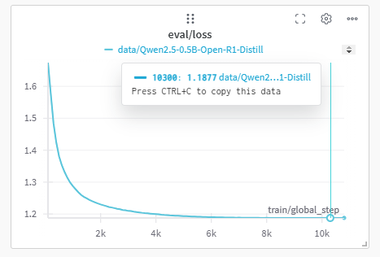
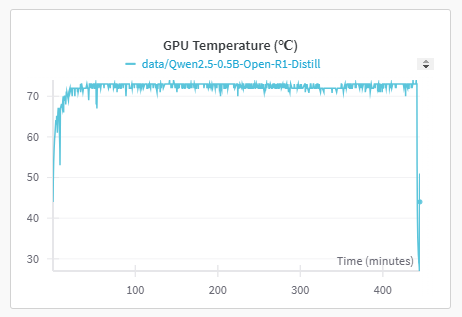
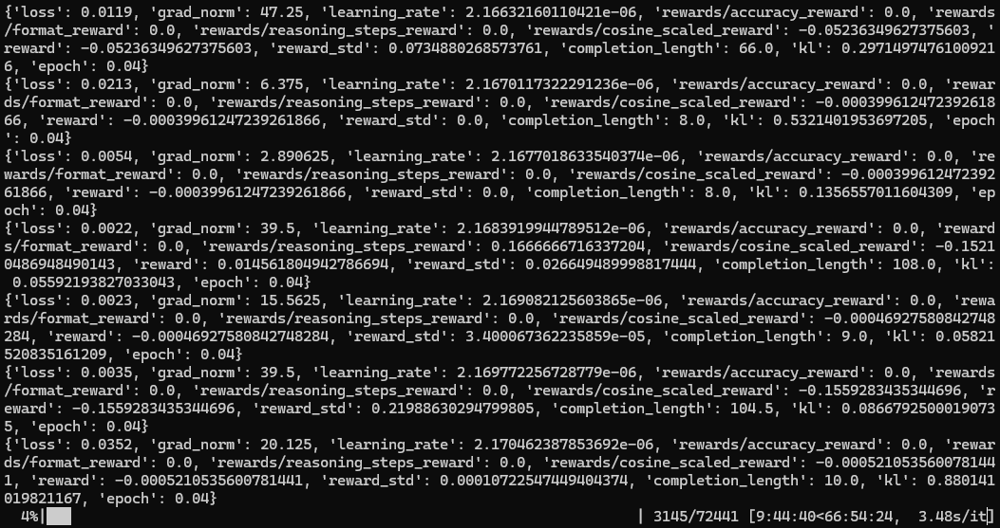

# Light Open R1

*这是一个轻量级的基于Open R1复现DeepSeek-R1的项目。主要用于系统的理解和学习DeepSeek-R1整个训练过程*

## 硬件配置
我的硬件配置为单卡RTX 3060 12G，以下命令都能成功运行，执行时间基于我的3060显卡，仅供参考

据说使用unsloth可以运行更大参数的模型，如果大家喜欢的化记得一键三连，我后续分享实践结果

## 环境配置
```shell
conda create -n light-open-r1 python=3.11 -y
conda activate light-open-r1
pip install vllm==0.7.1
pip install wandb
pip install flash-attn --no-build-isolation
pip install -e .
apt-get install git-lfs
#按需修改为你的proxy地址，否则无法拉取和推送模型
export HTTP_PROXY="http://192.168.4.86:4780"
export HTTPS_PROXY="http://192.168.4.86:4780"
huggingface-cli login
wandb login
```

## 执行训练
```shell
# 执行SFT训练，执行时间大约445分钟，注意观察显卡温度
python src/open_r1/sft.py --config recipes/Qwen2.5-0.5B-Instruct-light/grpo/config_demo.yaml
```






```shell
# 执行GRPO训练，时间较长，执行中截图如下
python src/open_r1/grpo.py --config recipes/Qwen2.5-0.5B-Instruct-light/grpo/config_demo.yaml
```



## 后续
平常工作较忙，抽空更新后续部分


以下为原Open R1项目内容翻译
---

**目录**  
1. [概述](#overview)  
2. [攻击计划](#plan-of-attack)  
3. [安装](#installation)  
4. [训练模型](#training-models)  
   - [SFT](#sft)  
   - [GRPO](#grpo)  
5. [评估模型](#evaluating-models)  
6. [复现Deepseek在MATH-500上的评估结果](#reproducing-deepseeks-evaluation-results-on-math-500)  
7. [数据生成](#data-generation)  
   - [从小型蒸馏R1模型生成数据](#generate-data-from-a-smol-distilled-r1-model)  
   - [从DeepSeek-R1生成数据](#generate-data-from-deepseek-r1)  
8. [贡献](#contributing)

## 概述

这个仓库的目标是构建R1流程中缺失的部分,使得每个人都能复现并在其基础上进行开发。该项目设计简单,主要包含:

- `src/open_r1`: 包含用于训练和评估模型以及生成合成数据的脚本:
    - `grpo.py`: 在给定数据集上使用GRPO训练模型。
    - `sft.py`: 在数据集上对模型进行简单的SFT。
    - `evaluate.py`: 在R1基准测试上评估模型。
    - `generate.py`: 使用[Distilabel](https://github.com/argilla-io/distilabel)从模型生成合成数据。
- `Makefile`: 包含利用上述脚本执行R1流程中每个步骤的易用命令。

### 攻击计划

我们将使用DeepSeek-R1的[技术报告](https://github.com/deepseek-ai/DeepSeek-R1)作为指南,大致可以分为三个主要步骤:

* 步骤1:通过从DeepSeek-R1蒸馏高质量语料库来复现R1-Distill模型。
* 步骤2:复现DeepSeek用于创建R1-Zero的纯RL流程。这可能需要为数学、推理和代码领域策划新的大规模数据集。
* 步骤3:展示我们可以通过多阶段训练从基础模型到RL调优。

<center>
    
</center>


## 安装

**注意:库依赖于CUDA 12.4。如果遇到段错误,请检查您的系统。**

要运行此项目中的代码,首先使用例如`uv`创建一个Python虚拟环境。
要安装`uv`,请参照[UV安装指南](https://docs.astral.sh/uv/getting-started/installation/)。

```shell
uv venv openr1 --python 3.11 && source openr1/bin/activate && uv pip install --upgrade pip --link-mode=copy
```

接下来,安装vLLM:

```shell
uv pip install vllm==0.7.1 --link-mode=copy
```

这也会安装PyTorch `v2.5.1`,使用这个版本**非常重要**,因为vLLM的二进制文件是为其编译的。然后,您可以通过`pip install -e .[LIST OF MODES]`为您的特定用例安装其余依赖项。对于大多数贡献者,我们建议:

```shell
GIT_LFS_SKIP_SMUDGE=1 uv pip install -e ".[dev]" --link-mode=copy
```

接下来,按如下方式登录您的Hugging Face和Weights and Biases账户:

```shell
huggingface-cli login
wandb login
```

最后,检查您的系统是否安装了Git LFS,以便您可以加载和推送模型/数据集到Hugging Face Hub:

```shell
git-lfs --version
```

如果未安装,运行:

```shell
sudo apt-get install git-lfs
```

## 训练模型

我们支持使用DDP或DeepSpeed(ZeRO-2和ZeRO-3)训练模型。例如,要在从DeepSeek-R1蒸馏的带有推理痕迹的数据集(如[Bespoke-Stratos-17k](https://huggingface.co/datasets/bespokelabs/Bespoke-Stratos-17k))上运行SFT,执行:

```shell
# 通过命令行训练
accelerate launch --config_file=recipes/accelerate_configs/zero3.yaml src/open_r1/sft.py \
    --model_name_or_path Qwen/Qwen2.5-1.5B-Instruct \
    --dataset_name HuggingFaceH4/Bespoke-Stratos-17k \
    --learning_rate 2.0e-5 \
    --num_train_epochs 1 \
    --packing \
    --max_seq_length 4096 \
    --per_device_train_batch_size 2 \
    --gradient_accumulation_steps 8 \
    --gradient_checkpointing \
    --bf16 \
    --output_dir data/Qwen2.5-1.5B-Open-R1-Distill

# 通过YAML配置训练
accelerate launch --config_file recipes/accelerate_configs/zero3.yaml src/open_r1/sft.py \
    recipes/Qwen/Qwen2.5-1.5B-Instruct/sft/config_demo.yaml
```

目前支持以下任务:

* 监督微调 `sft`
* 群组相对策略优化 `grpo`

> [!TIP]
> 如果您增加/减少GPU数量,我们建议同时调整每设备批量大小或梯度累积步数,以保持全局批量大小不变。

默认情况下,这些脚本会将每个模型推送到您的Hugging Face Hub用户名下,即`{username}/{model_name}-{task}`。您可以通过在命令后附加参数来覆盖每个YAML配置中的参数:

```shell
# 更改批量大小、训练轮数等
accelerate launch --config_file recipes/accelerate_configs/zero3.yaml src/open_r1/sft.py \
    recipes/Qwen/Qwen2.5-1.5B-Instruct/sft/config_demo.yaml
    --per_device_train_batch_size=1 --num_train_epochs=5
```

> [!NOTE]
> 下面的训练命令是为8 x H100s (80GB)的节点配置的。对于不同的硬件和拓扑结构,您可能需要调整批量大小和梯度累积步数。

### SFT

要在从DeepSeek-R1蒸馏的带有推理痕迹的数据集(如[Bespoke-Stratos-17k](https://huggingface.co/datasets/bespokelabs/Bespoke-Stratos-17k))上运行SFT,执行:

```shell
ACCELERATE_LOG_LEVEL=info accelerate launch --config_file recipes/accelerate_configs/zero3.yaml \
    src/open_r1/sft.py \
    --config recipes/Qwen2.5-1.5B-Instruct/sft/config_demo.yaml
```

### GRPO

要通过GRPO训练器进行训练,我们使用一个GPU运行vLLM以加快生成速度,其余GPU用于训练。例如,在8个GPU的节点上,使用`recipes/accelerate_configs/zero3.yaml`配置,然后覆盖`num_processes`以在7个设备上运行:

```shell
ACCELERATE_LOG_LEVEL=info accelerate launch --config_file recipes/accelerate_configs/zero3.yaml \
    --num_processes=7 src/open_r1/grpo.py \
    --config recipes/Qwen2.5-1.5B-Instruct/grpo/config_demo.yaml
```

我们提供了一个使用GRPO进行数学推理的最小可复现实验,参考了[SimpleRL-Reason](https://hkust-nlp.notion.site/simplerl-reason)的方法,该方法使用在8K个示例上训练的7B模型。在8个H100 80G GPU上运行大约需要3小时:

```shell
ACCELERATE_LOG_LEVEL=info accelerate launch --config_file recipes/accelerate_configs/zero2.yaml \
    --num_processes=7 src/open_r1/grpo.py \
    --config recipes/Qwen2.5-Math-7B/grpo/config_simple_rl.yaml
```

我们的最终[模型](https://huggingface.co/Dongwei/Qwen-2.5-7B_Base_Math_smalllr),虽然使用了不同的学习率、损失函数和奖励结构,在MATH-500上达到了69.4%的准确率,相比基础模型提高了17%以上。

### 在Slurm集群上启动作业

如果您可以访问Slurm集群,我们提供了一个`slurm/train.slurm`脚本,可以自动为您排队训练作业。以下是使用方法:

```shell
sbatch --job-name=open_r1 --nodes=1 slurm/train.slurm {model_name} {task} {config_suffix} {accelerator}
```

这里`{model_name}`和`{task}`如上定义,而`{config_suffix}`指特定配置,`{accelerator}`指`recipes/accelerate_configs`中的🤗 Accelerate配置选择。如果您想覆盖默认配置参数,可以通过附加一个空格分隔的字符串,如`'--arg1=value1 --arg2=value2'`。以下是在1个节点8个GPU上运行SFT的具体示例:

```shell
# 在Slurm上启动并覆盖默认超参数
sbatch --job-name=open_r1 --nodes=1 slurm/train.slurm Qwen2.5-1.5B-Instruct sft demo zero3 '--per_device_train_batch_size=1 --num_train_epochs=5'
```

您可以通过增加`--nodes`标志来扩展节点数量。

> [!NOTE]
> `slurm/train.slurm`中的配置是为Hugging Face计算集群优化的,可能需要调整以适应您自己的计算节点。

## 评估模型

我们使用`lighteval`来评估模型,在`src/open_r1/evaluate.py`中定义了自定义任务。对于适合单个GPU的模型,运行:

```shell
MODEL=deepseek-ai/DeepSeek-R1-Distill-Qwen-1.5B
MODEL_ARGS="pretrained=$MODEL,dtype=bfloat16,max_model_length=32768,gpu_memory_utilisation=0.8"
OUTPUT_DIR=data/evals/$MODEL

# AIME 2024
TASK=aime24
lighteval vllm $MODEL_ARGS "custom|$TASK|0|0" \
    --custom-tasks src/open_r1/evaluate.py \
    --use-chat-template \
    --output-dir $OUTPUT_DIR

# MATH-500
TASK=math_500
lighteval vllm $MODEL_ARGS "custom|$TASK|0|0" \
    --custom-tasks src/open_r1/evaluate.py \
    --use-chat-template \
    --output-dir $OUTPUT_DIR

# GPQA Diamond
TASK=gpqa:diamond
lighteval vllm $MODEL_ARGS "custom|$TASK|0|0" \
    --custom-tasks src/open_r1/evaluate.py \
    --use-chat-template \
    --output-dir $OUTPUT_DIR 
```

> [!IMPORTANT]
> 您必须在`vllm`命令中设置`max_model_length=32768`以与我们为每个评估定义的`generation_size`对齐。否则,`lighteval`将抛出错误。

要在多个GPU上提高吞吐量,使用_数据并行_如下:

```shell
NUM_GPUS=8
MODEL=deepseek-ai/DeepSeek-R1-Distill-Qwen-1.5B
MODEL_ARGS="pretrained=$MODEL,dtype=bfloat16,data_parallel_size=$NUM_GPUS,max_model_length=32768,gpu_memory_utilisation=0.8"
TASK=aime24
OUTPUT_DIR=data/evals/$MODEL

lighteval vllm $MODEL_ARGS "custom|$TASK|0|0" \
    --custom-tasks src/open_r1/evaluate.py \
    --use-chat-template \
    --output-dir $OUTPUT_DIR 
```

对于需要在GPU之间分片的大型模型,使用_张量并行_并运行:

```shell
NUM_GPUS=8
MODEL=deepseek-ai/DeepSeek-R1-Distill-Qwen-32B
MODEL_ARGS="pretrained=$MODEL,dtype=bfloat16,tensor_parallel_size=$NUM_GPUS,max_model_length=32768,gpu_memory_utilisation=0.8"
TASK=aime24
OUTPUT_DIR=data/evals/$MODEL

export VLLM_WORKER_MULTIPROC_METHOD=spawn
lighteval vllm $MODEL_ARGS "custom|$TASK|0|0" \
    --custom-tasks src/open_r1/evaluate.py \
    --use-chat-template \
    --output-dir $OUTPUT_DIR 
```

您也可以使用`make evaluate`启动评估,指定模型、任务,以及可选的并行技术和GPU数量。

在单个GPU上评估:

```shell
make evaluate MODEL=deepseek-ai/DeepSeek-R1-Distill-Qwen-32B TASK=aime24
```

使用数据并行:

```shell
make evaluate MODEL=deepseek-ai/DeepSeek-R1-Distill-Qwen-32B TASK=aime24 PARALLEL=data NUM_GPUS=8
```

使用张量并行:

```shell
make evaluate MODEL=deepseek-ai/DeepSeek-R1-Distill-Qwen-32B TASK=aime24 PARALLEL=tensor NUM_GPUS=8
```

## 复现Deepseek的评估结果

> [!NOTE]
> DeepSeek-R1论文使用温度为0.6、top-p值为0.95的采样,每个查询64个响应来估计`pass@1`。以下我们报告的是贪婪解码的结果,这可能解释了我们的结果与他们的结果之间1-3σ的小差异。

### MATH-500

我们能够在1-3个标准差内复现Deepseek在MATH-500基准测试上报告的结果:

| 模型                         | MATH-500 (🤗 LightEval) | MATH-500 (DeepSeek报告) |
|:------------------------------|:-----------------------:|:----------------------------:|
| DeepSeek-R1-Distill-Qwen-1.5B |          81.2           |             83.9             |
| DeepSeek-R1-Distill-Qwen-7B   |          91.8           |             92.8             |
| DeepSeek-R1-Distill-Qwen-14B  |          94.2           |             93.9             |
| DeepSeek-R1-Distill-Qwen-32B  |          95.0           |             94.3             |
| DeepSeek-R1-Distill-Llama-8B  |          85.4           |             89.1             |
| DeepSeek-R1-Distill-Llama-70B |          93.4           |             94.5             |

要复现这些结果,使用以下命令:

```shell
NUM_GPUS=1 # 对于32B和70B模型设置为8
MODEL=deepseek-ai/{model_name}
MODEL_ARGS="pretrained=$MODEL,dtype=bfloat16,max_model_length=32768,gpu_memory_utilisation=0.8,tensor_parallel_size=$NUM_GPUS"
OUTPUT_DIR=data/evals/$MODEL

lighteval vllm $MODEL_ARGS "custom|math_500|0|0" \
    --custom-tasks src/open_r1/evaluate.py \
    --use-chat-template \
    --output-dir $OUTPUT_DIR
```

或者,您可以按如下方式启动Slurm作业:

```shell
python scripts/run_benchmarks.py --model-id={model_id}  --benchmarks math_500
```

### GPQA Diamond

我们能够在1-3个标准差内复现Deepseek在GPQA Diamond基准测试上报告的结果:

| 模型                         | GPQA Diamond (🤗 LightEval) | GPQA Diamond (DeepSeek报告) |
|:------------------------------|:---------------------------:|:--------------------------------:|
| DeepSeek-R1-Distill-Qwen-1.5B |            33.3             |               33.8               |
| DeepSeek-R1-Distill-Qwen-7B   |            48.4             |               49.1               |
| DeepSeek-R1-Distill-Qwen-14B  |            55.6             |               59.1               |
| DeepSeek-R1-Distill-Qwen-32B  |            58.6             |               62.1               |
| DeepSeek-R1-Distill-Llama-8B  |            51.0             |               49.0               |
| DeepSeek-R1-Distill-Llama-70B |            65.2             |               65.2               |

要复现这些结果,使用以下命令:

```shell
NUM_GPUS=1 # 对于32B和70B模型设置为8
MODEL=deepseek-ai/{model_name}
MODEL_ARGS="pretrained=$MODEL,dtype=bfloat16,max_model_length=32768,gpu_memory_utilisation=0.8,tensor_parallel_size=$NUM_GPUS"
OUTPUT_DIR=data/evals/$MODEL

lighteval vllm $MODEL_ARGS "custom|gpqa:diamond|0|0" \
    --custom-tasks src/open_r1/evaluate.py \
    --use-chat-template \
    --output-dir $OUTPUT_DIR
```

```shell
python scripts/run_benchmarks.py --model-id={model_id}  --benchmarks gpqa
```

## 数据生成

### 从小型蒸馏R1模型生成数据

以下示例可以在1xH100上运行。
首先安装以下依赖:

```shell
uv pip install "distilabel[vllm]>=1.5.2"
```

现在将以下代码片段保存到名为`pipeline.py`的文件中,并用`python pipeline.py`运行。它将为10个示例中的每一个生成4个输出(将仓库的用户名更改为您的组织/用户名):

```python
from datasets import load_dataset
from distilabel.models import vLLM
from distilabel.pipeline import Pipeline
from distilabel.steps.tasks import TextGeneration


prompt_template = """\
You will be given a problem. Please reason step by step, and put your final answer within \boxed{}:
{{ instruction }}"""

dataset = load_dataset("AI-MO/NuminaMath-TIR", split="train").select(range(10))

model_id = "deepseek-ai/DeepSeek-R1-Distill-Qwen-7B"  # Exchange with another smol distilled r1

with Pipeline(
    name="distill-qwen-7b-r1",
    description="A pipeline to generate data from a distilled r1 model",
) as pipeline:

    llm = vLLM(
        model=model_id,
        tokenizer=model_id,
        extra_kwargs={
            "tensor_parallel_size": 1,
            "max_model_len": 8192,
        },
        generation_kwargs={
            "temperature": 0.6,
            "max_new_tokens": 8192,
        },
    )
    prompt_column = "problem"
    text_generation = TextGeneration(
        llm=llm, 
        template=prompt_template,
        num_generations=4,
        input_mappings={"instruction": prompt_column} if prompt_column is not None else {}
    )


if __name__ == "__main__":
    distiset = pipeline.run(dataset=dataset)
    distiset.push_to_hub(repo_id="username/numina-deepseek-r1-qwen-7b")
```

查看[HuggingFaceH4/numina-deepseek-r1-qwen-7b](https://huggingface.co/datasets/HuggingFaceH4/numina-deepseek-r1-qwen-7b)的示例数据集。

### 从DeepSeek-R1生成数据

要运行更大的DeepSeek-R1,我们使用了2个节点,每个节点有8×H100 GPU,使用本仓库中`slurm/generate.slurm`的slurm文件。首先,安装依赖项:

(目前我们需要安装[修复R1 cuda图捕获](https://github.com/vllm-project/vllm/commits/221d388cc5a836fa189305785ed7e887cea8b510/csrc/moe/moe_align_sum_kernels.cu)的vllm开发版轮子)
```shell
pip install https://wheels.vllm.ai/221d388cc5a836fa189305785ed7e887cea8b510/vllm-1.0.0.dev-cp38-abi3-manylinux1_x86_64.whl --extra-index-url https://download.pytorch.org/whl/cu121

uv pip install "distilabel[vllm,ray,openai]>=1.5.2"
```

然后运行以下命令:

```shell
sbatch slurm/generate.slurm \
    --hf-dataset AI-MO/NuminaMath-TIR \
    --temperature 0.6 \
    --prompt-column problem \
    --model deepseek-ai/DeepSeek-R1 \
    --hf-output-dataset username/r1-dataset
```

> [!NOTE]  
> 在作业运行时,您可以通过集群登录节点设置SSH隧道来从您的计算机访问Ray仪表板,运行`ssh -L 8265:ray_ip_head_node:8265 <login_node>`,然后浏览`http://localhost:8265`

## 贡献

欢迎贡献。请参考 https://github.com/huggingface/open-r1/issues/23。
